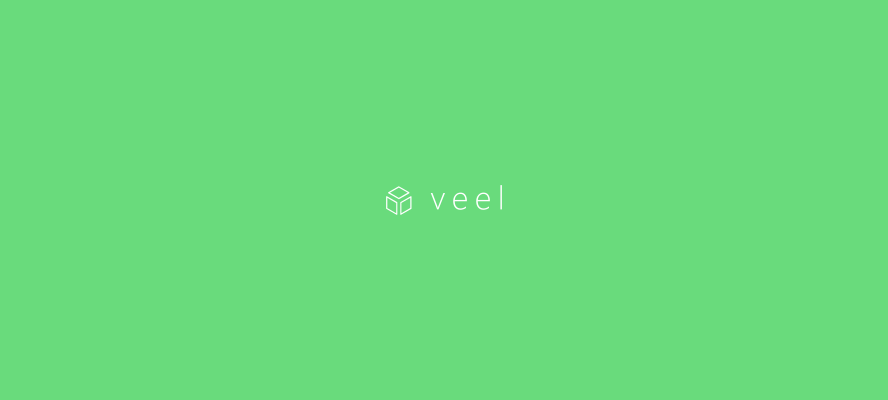
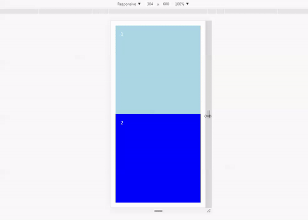

# veel [![NPM version][version-image]][version-url] [![Js Standard Style][standard-image]][standard-url]

:package: Base styling components using [`fela`](http://fela.js.org) with a [design system](https://github.com/jxnblk/styled-system)

* **Low-Level** - Exposes only a few components which can be used as a base layer to build your UI components upon
* **Consistency** - Uses `styled-system` which encourages consistency of spacing, typography and color
* **Universal** - By using fela it's really easy to prerender your styles on the server or anywhere

```
npm install veel
```

```js
const Badge = (props) => (
  <Box
    m={2}
    fontSize={2}
    bg='tomato'
    css={{ textDecoration: 'underline' }}
    {...props}
  />
)
```

## Contents

* [Example](#example)
* [Usage](#usage)
* [Components](#components)
  + [Box](#box)
  + [Flex](#flex)
* [Plugins](#plugins)
  + [Recommend plugins](#recommend-plugins)
* [Author](#author)

## Example

The following renders a responsive row with two equally divided divs collapsing on mobile.



```js
const CenteredBox = props => (
  <Box
    p={2}
    w={[1, 0.5]}
    css={{ height: '50%' }}
    {...props}
  />
)

const App = () => (
  <Flex
    wrap
    align='center'
    css={{ height: '100vh' }}
  >
    <CenteredBox bg='lightblue'>1</CenteredBox>
    <CenteredBox color='white' bg='blue'>2</CenteredBox>
  </Flex>
)
```

## Usage

1. Create a [`fela`](http://fela.js.org/docs/api/fela-native/createRenderer.html) renderer.

```js
import { createRenderer } from 'veel'
const renderer = createRenderer()
```

2. Wrap your application in a `StyleProvider` so that each `veel` component has access to the renderer and the optional theme.

```js
import { StyleProvider, Box } from 'veel'

class App extends React.Component {
  render() {
    return (
      <StyleProvider={renderer}>
        <Box is='h1' fontSize={2}>Application</Box>
      </StyleProvider>
    )
  }
}
```

3. Now you need some way of injecting the generated css into the html. There are many ways to do it, each with their positive and negative aspects.

**Injecting the css dynamically**
```js
require('inject-css')(renderer.renderToString())
```

**Render to a sheet list (next.js example)**

This makes the most sense when you also create the document skeleton with JSX. (like with [Next.js](https://ghub.io/next)

```js
import Document, { Head } from 'next/document'

class CustomDocument extends Document {
  static getInitialProps ({ renderPage }) {
    const page = renderPage()
    const sheets = renderer.renderToSheetList()
    renderer.clear()
    return { ...page, sheets }
  }

  render () {
    const sheets = this.props.sheets
    return (
      <Head>
        {sheets.map(({ type, media, css }) => (
          <style data-fela-type={type} media={media}>{css}</style>
        ))}
      </Head>

      ...
    )
  }
}
```

4. You're done!

```js
<Box css={{
  animationName: {
  '0%': { color: 'red ' },
  '100%': { color: 'blue' }
  },
}} />

// -> { animationName: 'k1' }
```

## Components

### Box

```js
<Box w={1}>Hello Veel!</Box>
```

The core layout component. Take a look at [`styled-system`](https://github.com/jxnblk/styled-system/blob/master/README.md) for documentation on `<Box />` `props`.

#### `Box.is`

By default a `<Box />` component will render out to a `div`. You can change the tag by providing an `is` property.

### Flex

```js
<Flex wrap center />
```

[View the example](./demo/src/index.js) on how to use it.

#### `Flex.center`

Sets both `alignItems` and `justifyContent` to `center`.

#### `Flex.wrap`

Sets `flexWrap` to `wrap`.

#### `Flex.column`

Sets `flexDirection` to `column`.

#### `Flex.justify`

CSS `justifyContent` property.

#### `Flex.align`

CSS `alignItem` property.

#### `Flex.order`

CSS `order` property.

## Plugins

By using fela you have a wide variety of plugins available. Check out the [plugin list](http://fela.js.org/docs/introduction/Ecosystem.html#plugins)

### Recommend plugins

* [**`fela-plugin-embedded`**](https://github.com/rofrischmann/fela/tree/master/packages/fela-plugin-embedded) - Inline keyframes and font-faces

## Author

**veel** © [Fabian Eichenberger](https://github.com/queckezz), Released under the [MIT](./license) License.<br>
Authored and maintained by Fabian Eichenberger with help from contributors ([list](https://github.com/queckezz/veel/contributors)).

> GitHub [@queckezz](https://github.com/queckezz) · Twitter [@queckezz](https://twitter.com/queckezz)

[version-image]: https://img.shields.io/npm/v/fmt-obj.svg?style=flat-square
[version-url]: https://npmjs.org/package/fmt-obj

[standard-image]: https://img.shields.io/badge/code-standard-brightgreen.svg?style=flat-square
[standard-url]: https://github.com/feross/standard
